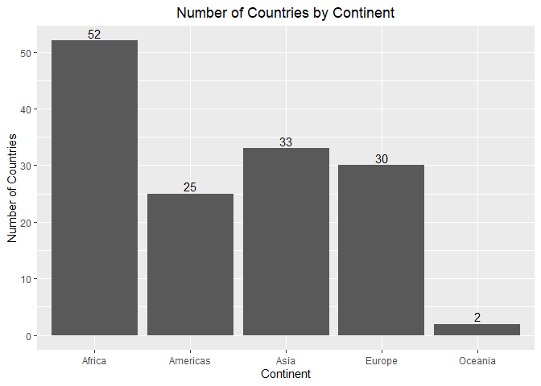

Gapminder Exploration
================
Kenny Chiu
2019-09-17

## Introduction

We explore the `gapminder` dataset that is available from the
`gapminder` R package. The dataset has 1704 observations and has 6
variables including

  - country
  - continent
  - year
  - life expectancy at birth
  - total population
  - per-capita GDP (in units of international dollars)

The dataset includes observations from 5 continents. The number of
countries included in the dataset is shown in the following plot.

``` r
df[c("country", "continent")] %>%
  distinct() %>%
  group_by(continent) %>%
  summarise(num_country = length(continent)) %>%
  ggplot(aes(x = continent, y = num_country)) +
    geom_bar(stat = "identity") +
    geom_text(aes(label = num_country), vjust = -0.3) +
    labs(title = "Number of Countries by Continent", x = "Continent", y = "Number of Countries") +
    theme(plot.title = element_text(hjust = 0.5))
```

<!-- -->
