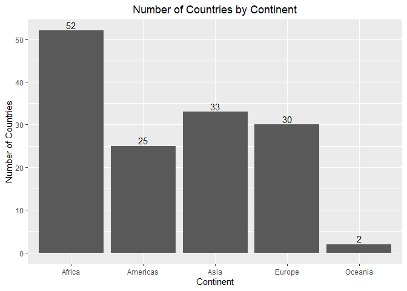
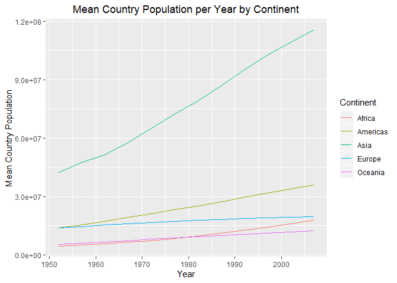
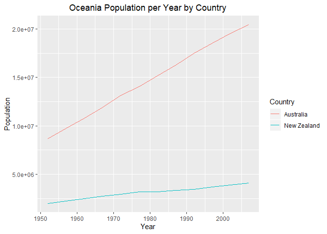

Gapminder Exploration
================
Kenny Chiu
2019-09-17

## Introduction

We explore the `gapminder` dataset that is available from the
`gapminder` R package. Note that this exploration also uses the `dplyr`
and `ggplot2` R packages.

The dataset has 1704 observations and has 6 variables including

  - country
  - continent
  - year
  - life expectancy at birth
  - total population
  - per-capita GDP (in units of international dollars)

The dataset includes observations from 5 continents. The number of
countries included in the dataset is shown in the following plot.

``` r
df = gapminder

# Process data
df[c("country", "continent")] %>%
  distinct() %>%
  group_by(continent) %>%
  summarise(num_country = length(continent)) %>%
  
# Draw and label bar graph
  ggplot(aes(x = continent, y = num_country)) +
    geom_bar(stat = "identity") +
    geom_text(aes(label = num_country), vjust = -0.3) +
    labs(title = "Number of Countries by Continent",
         x = "Continent",
         y = "Number of Countries") +
    theme(plot.title = element_text(hjust = 0.5))
```

<!-- -->

## Sample Analysis: Population by Continent

We visualize the mean country population per year for each
continent/region. In general, we see that the mean population has been
increasing over time in each continent.

``` r
# Process data
df[c("continent", "year", "pop")] %>%
  group_by(continent, year) %>%
  summarise(mean_total_pop = mean(pop)) %>%
  
# Draw and label line graph
  ggplot(aes(x = year, y = mean_total_pop, group = continent)) +
    geom_line(aes(color = continent)) +
    labs(title = "Mean Country Population per Year by Continent",
         x = "Year",
         y = "Mean Country Population",
         color = "Continent") +
    theme(plot.title = element_text(hjust = 0.5))
```

<!-- -->

## Sample Analysis: Population by Country

We drill down further and visualize the total population over time for
each country in the Oceania region. We see that the population grows at
a faster rate in Australia compared to New Zealand.

``` r
# Process data
df[c("country", "continent", "year", "pop")] %>%
  filter(continent == "Oceania") %>%
  
# Draw and label line graph
  ggplot(aes(x = year, y = pop)) +
    geom_line(aes(color = country)) +
    labs(title = "Oceania Population per Year by Country",
         x = "Year",
         y = "Population",
         color = "Country") +
    theme(plot.title = element_text(hjust = 0.5))
```

<!-- -->
