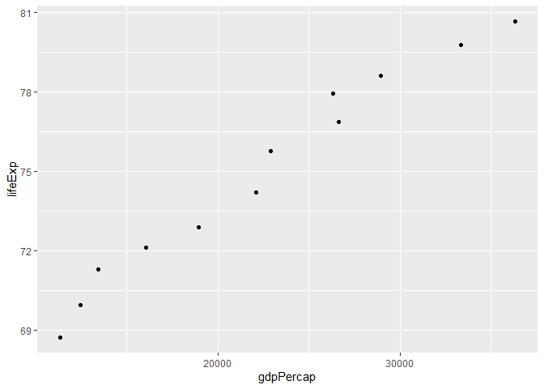

Gapminder Exploration
================
Kenny Chiu
2019-09-24

## Introduction

we explore the `gapminder` dataset available in the `gapminder` R
package. This exploration also uses the `tidyverse` R package.

## Exercise 1: Basic `dplyr`

### 1.1

We filter the `gapminder` data to include only data from Canada, the
United States, and Taiwan in the
1970’s.

``` r
(df = filter(gapminder, country == "Canada" | country == "United States" | country == "Taiwan",
                  year >= 1970 & year <= 1979))
```

    ## # A tibble: 6 x 6
    ##   country       continent  year lifeExp       pop gdpPercap
    ##   <fct>         <fct>     <int>   <dbl>     <int>     <dbl>
    ## 1 Canada        Americas   1972    72.9  22284500    18971.
    ## 2 Canada        Americas   1977    74.2  23796400    22091.
    ## 3 Taiwan        Asia       1972    69.4  15226039     4063.
    ## 4 Taiwan        Asia       1977    70.6  16785196     5597.
    ## 5 United States Americas   1972    71.3 209896000    21806.
    ## 6 United States Americas   1977    73.4 220239000    24073.

### 1.2

We extract the `country` and `gdpPercap` variables from the filtered
dataset.

``` r
df %>%
  select(country, gdpPercap)
```

    ## # A tibble: 6 x 2
    ##   country       gdpPercap
    ##   <fct>             <dbl>
    ## 1 Canada           18971.
    ## 2 Canada           22091.
    ## 3 Taiwan            4063.
    ## 4 Taiwan            5597.
    ## 5 United States    21806.
    ## 6 United States    24073.

### 1.3

We filter the `gapminder` dataset to all entries that have experienced a
drop in life expectancy.

``` r
df = gapminder
df %>%
  group_by(continent, country) %>%
  mutate(lifeExp_inc = lifeExp - lag(lifeExp, order_by = year)) %>%
  filter(lifeExp_inc < 0)
```

    ## # A tibble: 102 x 7
    ## # Groups:   continent, country [52]
    ##    country  continent  year lifeExp     pop gdpPercap lifeExp_inc
    ##    <fct>    <fct>     <int>   <dbl>   <int>     <dbl>       <dbl>
    ##  1 Albania  Europe     1992    71.6 3326498     2497.      -0.419
    ##  2 Angola   Africa     1987    39.9 7874230     2430.      -0.036
    ##  3 Benin    Africa     2002    54.4 7026113     1373.      -0.371
    ##  4 Botswana Africa     1992    62.7 1342614     7954.      -0.877
    ##  5 Botswana Africa     1997    52.6 1536536     8647.     -10.2  
    ##  6 Botswana Africa     2002    46.6 1630347    11004.      -5.92 
    ##  7 Bulgaria Europe     1977    70.8 8797022     7612.      -0.09 
    ##  8 Bulgaria Europe     1992    71.2 8658506     6303.      -0.15 
    ##  9 Bulgaria Europe     1997    70.3 8066057     5970.      -0.87 
    ## 10 Burundi  Africa     1992    44.7 5809236      632.      -3.48 
    ## # ... with 92 more rows

### 1.4

We filter the `gapminder` dataset so that it shows the max GDP per
capita experienced by each country.

``` r
df = gapminder
df %>%
  group_by(country) %>%
  filter(gdpPercap == max(gdpPercap))
```

    ## # A tibble: 142 x 6
    ## # Groups:   country [142]
    ##    country     continent  year lifeExp       pop gdpPercap
    ##    <fct>       <fct>     <int>   <dbl>     <int>     <dbl>
    ##  1 Afghanistan Asia       1982    39.9  12881816      978.
    ##  2 Albania     Europe     2007    76.4   3600523     5937.
    ##  3 Algeria     Africa     2007    72.3  33333216     6223.
    ##  4 Angola      Africa     1967    36.0   5247469     5523.
    ##  5 Argentina   Americas   2007    75.3  40301927    12779.
    ##  6 Australia   Oceania    2007    81.2  20434176    34435.
    ##  7 Austria     Europe     2007    79.8   8199783    36126.
    ##  8 Bahrain     Asia       2007    75.6    708573    29796.
    ##  9 Bangladesh  Asia       2007    64.1 150448339     1391.
    ## 10 Belgium     Europe     2007    79.4  10392226    33693.
    ## # ... with 132 more rows

### 1.5 TODO

We produce a scatterplot of Canada’s life expectancy vs log GDP per
capita.

``` r
filter(gapminder, country == "Canada") %>%
  ggplot(aes(gdpPercap, lifeExp)) +
  geom_point() +
  scale_x_log10("GDP per capita", labels = scales::dollar_format())
```


