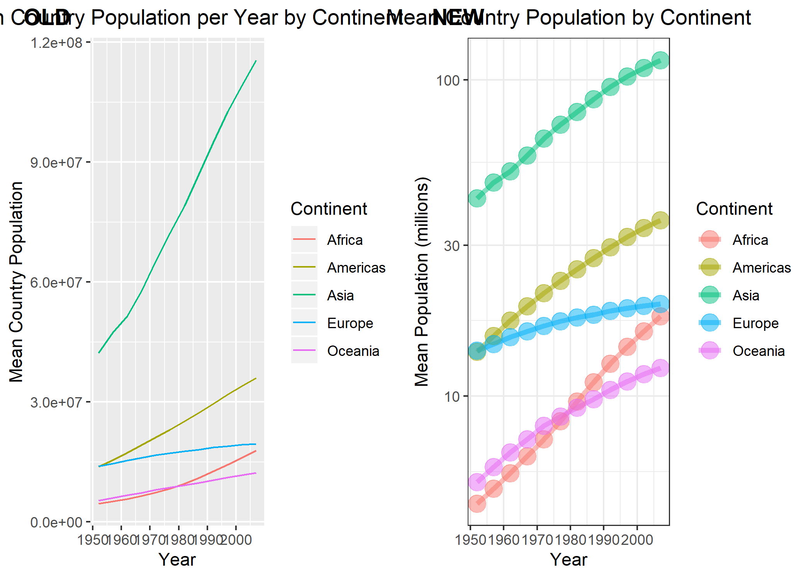
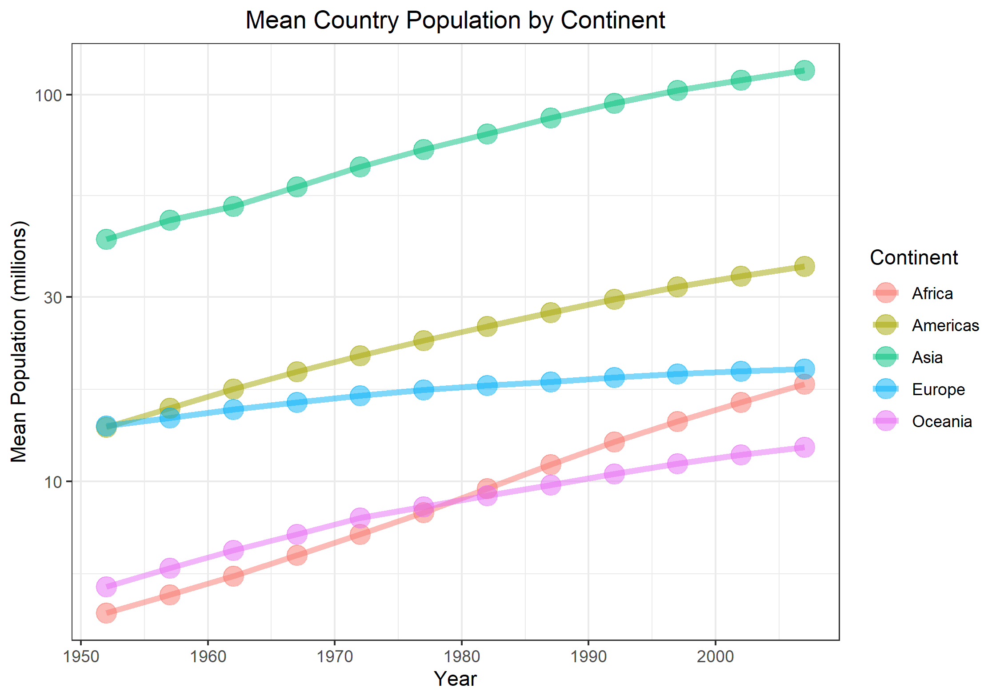

```{r, include = FALSE}
knitr::opts_chunk$set(fig.align = "center")
```


## Navigation

Back to the [repository](https://github.com/STAT545-UBC-hw-2019-20/stat545-hw-chiukenny/tree/master/hw05).


## Introduction

We use the `gapminder` dataset as an example to explore concepts in data portability, collaboration and dissemination. We primarily use the `tidyverse` R package to carry out these tasks. Other libraries that we use are listed below in the initialization step.

```{r, message = FALSE}
library(gapminder)
library(tidyverse)

library(ggridges) # For density plot
library(scales)   # For label formatting
library(here)     # For file pathing
library(cowplot)  # for plotting in grids
```


## Exercise 1: `here::here`

The `here::here` function has three main advantages over other approaches used for setting paths.

1. **It makes it easier to use sub-directories in projects**

`here::here` automatically detects the root directory and if used in a RStudio project, `here::here` uses the project root. This means that you only need to specify the path from the project root to the sub-directory instead of specifying the full absolute path.

2. **It makes it easier for other people to your code**

When working with others, the collaborators will generally have a local copy of the project. Because you only need to specify the path from the project root, `here::here` will work regardless of where the local copy of the project is stored for each collaborator.

3. **It writes paths safely across operating systems**

The paths that `here::here` takes in as arguments are platform-independent. This means that even if your collaborators work on different operating systems, `here::here` will still work without needing to be modified.


## Exercise 2: Factor management

### Drop Oceania

We explore the `continent` variable in the `gapminder` dataset. We first verify that `continent` is a factor.

```{r ex2.verify_factor}
class(gapminder$continent)
```

We drop the level "Oceania" from `continent` and observe the number of rows and levels before and after the drop.

```{r ex2.drop_levels.1}
nrow(gapminder)
```

```{r ex2.drop_levels.2}
levels(gapminder$continent)
```


There are `r nrow(gapminder)` rows and `r nlevels(gapminder$continent)` `continent` levels before the drop.

```{r ex2.drop_levels.3}
gp_drop_ocn = gapminder %>%
  filter(continent != "Oceania") %>%
  mutate(continent = fct_drop(continent))

nrow(gp_drop_ocn)
```

```{r ex2.drop_levels.4}
levels(gp_drop_ocn$continent)
```

After the drop, there are now `r nrow(gp_drop_ocn)` rows and `r nlevels(gp_drop_ocn$continent)` levels.

### Reorder `continent`

We now look to reorder the levels of `continent` based on the trimmed mean (10% off each end) total population in increasing order. We use the `forcats` package in the `tidyverse` library to do so.

```{r ex2.reorder_levels.1}
# Define a trimmed mean function with a set trim value
trimmed.mean = function(x)
{
  return(mean(x, trim = 0.1))
}

gp_reorder = gp_drop_ocn %>%
  mutate(continent = fct_reorder(continent, pop, trimmed.mean))

levels(gp_reorder$continent)
```

The levels of `continent` has changed from [`r levels(gp_drop_ocn$continent)`] to [`r levels(gp_reorder$continent)`]. We check the trimmed mean total population to make sure that the new order of levels is correct.

```{r ex2.reorder_levels.2}
gp_reorder %>%
  group_by(continent) %>%
  summarize(trimMeanPop = trimmed.mean(pop)) %>%
  knitr::kable()
```

### Re-level `continent`

We now look to re-level the data so that the level "Americas" is first. We first look at the data prior to the re-level.

```{r ex2.relevel_factor.1}
gp_reorder %>%
  arrange(continent) %>%
  DT::datatable()
```

Note that African countries are shown at the top of the list.

```{r ex2.relevel_factor.2}
gp_relevel = gp_reorder %>%
  mutate(continent = fct_relevel(continent, "Americas"))

levels(gp_relevel$continent)
```

```{r ex2.relevel_factor.3}
gp_relevel %>%
  arrange(continent) %>%
  DT::datatable()
```

Now countries in the Americas are shown first.

### Plot re-leveled `continent`

We look at the effect of re-leveling on plots. Here we have a density plot of the total population for each `continent` prior to the re-leveling. Note that "Africa" is the first continent listed from bottom to top.

```{r ex2.plot_relevel.1, message = FALSE}
gp_reorder %>%
  ggplot(aes(pop, continent, fill = continent)) +
  geom_density_ridges(alpha = 0.7) +
  scale_discrete_manual("fill", values = c("red", "green", "blue", "purple")) +
  scale_x_log10(labels = comma_format()) +
  labs(title = "Total Population by Continent",
       x = "Total Population",
       y = "Continent") +
  theme_bw() +
  theme(legend.position = "none")
```

The plot below shows the density plot after re-leveling. Now "Americas" is the first continent listed from the bottom.

```{r ex2.plot_relevel.2, message = FALSE}
gp_relevel %>%
  ggplot(aes(pop, continent, fill = continent)) +
  geom_density_ridges(alpha = 0.7) +
  scale_discrete_manual("fill", values = c("green", "red", "blue", "purple")) +
  scale_x_log10(labels = comma_format()) +
  labs(title = "Total Population by Continent",
       x = "Total Population",
       y = "Continent") +
  theme_bw() +
  theme(legend.position = "none")
```


## Exercise 3: File input/output

Our exploration of total population in Exercise 2 can be misleading as we do not distinguish between recent and historical data points. Rather than looking at all the data points for each continent, we will compare the mean total population of the most recent year (`r max(gapminder$year)`) to that of the oldest year (`r min(gapminder$year)`) for each continent.

```{r ex3.manipulate}
gp_pop_change = gapminder %>%
  filter(continent != "Oceania",
         year == min(year) | year == max(year)) %>%
  group_by(continent, year) %>%
  summarize(meanPop = mean(pop)) %>%
  pivot_wider(id_cols = continent,
              names_from = year,
              names_prefix = "meanPop",
              values_from = meanPop) %>%
  mutate(meanPopChange = meanPop2007 - meanPop1952,
         meanPopPropChange = round(meanPop2007 / meanPop1952, 2))

gp_pop_change %>%
  knitr::kable()
```

We write this new dataset to CSV.

```{r ex3.write}
write_csv(gp_pop_change,
          here("hw05", "data", "gapminder_population_change.csv"))
```

We read in the dataset from CSV to verify that it was saved properly.

```{r ex3.read, message = FALSE}
gp_pop_chng_csv = read_csv(here("hw05", "data", "gapminder_population_change.csv"))

gp_pop_chng_csv %>%
  knitr::kable()
```

Success! However, it looks like `continent` is no longer recognized as a factor.

```{r ex3.verify_factor}
class(gp_pop_chng_csv$continent)
```

We fix this and also reorder the levels by the largest change in proportion in mean population.

```{r ex3.reorder}
gp_pop_chng_csv %>%
  mutate(continent = fct_reorder(continent, meanPopPropChange, .desc = TRUE)) %>%
  arrange(continent) %>%
  knitr::kable()
```

We see that although Africa has the smallest mean population and raw growth, it had the greatest growth proportion-wise having almost quadrupled in mean population between (`r min(gapminder$year)`) and (`r max(gapminder$year)`).

In this exercise, we showed that while we were able to successfully write the dataset to CSV and read it back, we had to manually cast `continent` back to a factor.


## Exercise 4: Visualization design

We revisit the plot of mean population per year per continent that we created for [Assignment 1](https://github.com/STAT545-UBC-hw-2019-20/stat545-hw-chiukenny/blob/master/hw01/hw01_gapminder.md). The original plot and code is shown below.

```{r ex4.original}
# Process data
original_plot = gapminder[c("continent", "year", "pop")] %>%
  group_by(continent, year) %>%
  summarise(mean_total_pop = mean(pop)) %>%
  
# Draw and label line graph
  ggplot(aes(x = year, y = mean_total_pop, group = continent)) +
    geom_line(aes(color = continent)) +
    labs(title = "Mean Country Population per Year by Continent",
         x = "Year",
         y = "Mean Country Population",
         color = "Continent") +
    theme(plot.title = element_text(hjust = 0.5))

original_plot
```

We re-write the code to be cleaner and re-do the plot to be more effective.

```{r ex4.new}
# Process data
new_plot = gapminder %>%
  group_by(continent, year) %>%
  summarise(meanPop = mean(pop) / 1000000) %>%
  
# Draw and label line graph
  ggplot(aes(year, meanPop, group = continent)) +
  geom_line(aes(color = continent), size = 1.5, alpha = 0.5) +
  geom_point(aes(color = continent), size = 5, alpha = 0.5) +
  scale_y_log10() +
  labs(title = "Mean Country Population per Year by Continent",
       x = "Year",
       y = "Mean Population (millions)",
       color = "Continent") +
  theme_bw() +
  theme(plot.title = element_text(hjust = 0.5))

new_plot
```

We compare the two plots side-by-side below. The changes made to the old plot include:

* changing the y-axis to a log scale so that the continents are not all grouped up near the bottom of the plot
* re-labeling the y-axis so that the labels are cleaner and easier to read
* adding points to the lines to make it visually clear where the actual data points are
* making the lines and points semi-transparent so that crossing and overlapping lines are still visible
* replacing the default grey theme with something more appealing

While the new plot remains simple, these changes make the new plot easier to read and visually more appealing.

```{r ex4.comparison, fig.width = 12}
plot_grid(original_plot, new_plot, ncol = 2,
          labels = c("OLD", "NEW"))
```


## Exercise 5: Writing figures to file

We save the new improved plot from Exercise 4 to file. We try using the `ggsave` function to do so.

```{r ex5.save, message = FALSE}
ggsave(here("hw05", "plots", "ex4_not_improved_plot.png"))
```

We now load that saved file here.

<center>



</center>

It turns out that we saved the wrong plot because we didn't specify the plot to save, and so `ggsave` just saved the last displayed plot. The resolution of the image also needs to be adjusted. We try again with more specifications.

```{r ex5.save.2, message = FALSE}
ggsave(here("hw05", "plots", "ex4_improved_plot.png"),
       plot = new_plot,
       width = 5, height = 3.5, scale = 1.5)
```

<center>



</center>

This time `ggsave` worked as we intended it to.